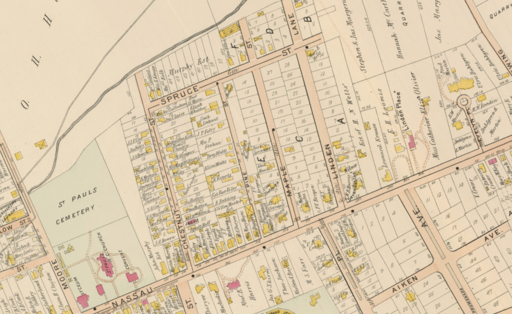
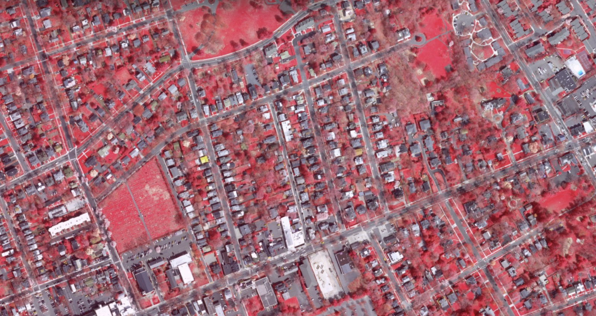

{: .text-center }

*Spruce, Chestnut, Pine, Maple, and Linden in the Lathrop atlas of 1905 (plate 23). [Click to explore it yourself.](https://townshipandborough.org/spy?v=16.97/-74.65288/40.35378/r445/bir_2015/slathrop_1905_p23)*

# What Princeton's New Zoning Code Means for Our Neighborhood

*A Tree-Street centered reading of the September 2026 Code Diagnostic — Adam Wolf, 82 Spruce Street*

---

**Contents**

1. [Why I read this](#why-i-read-this)
2. [Broad thoughts](#broad-thoughts)
3. [The good news](#the-good-news)
4. [The same provision, three readers](#the-same-provision-three-readers)
5. [The bad news](#the-bad-news)
6. [What I am asking of you](#what-i-am-asking-of-you)

---

## Why I read the Code Diagnostic

On September 17, 2026, the Municipality released a **Code Diagnostic** prepared by the consulting firm Camiros. It is the first public product of a multi-year project to replace Princeton's zoning code. It is 67 pages, it is written in planner's language, and almost nobody outside 400 Witherspoon has or will read it. 

I read all of it, twice, because I have learned the hard way that the decisions that change a neighborhood are made in documents like this one, with little time to review before they are is ratified. 

There is a public meeting on **Thursday, September 24**. This page is my attempt to tell you what is in the document before then.

I want to say up front what I said [in April](note-to-neighbors): I support more housing in Princeton, and I support our affordable housing obligation. Our block already has single-family homes, duplexes, basement apartments, and small apartment buildings. We are not an enclave, and I am not arguing for one. I am arguing that the rules should be written in public, with the numbers on the table, and that the people who live with the result should be in the room.

Because that argument depends on facts about this neighborhood rather than adjectives about it, I have also put [a portrait of the Tree Streets](treestreets) on this site — 172 residential lots, drawn from the tax rolls, the parcel GIS, and the building assessments. I draw on it below.

## Broad thoughts

**Most of what this document wants to do is good.** Princeton has operated under two zoning codes since consolidation in 2013 — one inherited from the Borough, one from the Township. Dozens of districts and overlays. Provisions written by different hands since [at least 1955](https://townshipandborough.org/spy?v=13.90/-74.65207/40.34634/r0/bzoning_1955/sortho_1947). The zoning code is genuinely hard to use, even for people who do this for a living. A complete rewrite, with plain language, illustrations, and a single table showing what is allowed where, is a real public good. Predictability reduces anxiety and conflict.

**One thing bothers me, and it is about trust rather than planning.** When Council hired Camiros in August 2025, the contract was for a *Zoning Code* update. The Request for Proposals had offered an optional second piece — rewriting the rest of the Land Use Code, the half that governs how projects get approved, who decides, and what notice is given. Camiros's proposal names that optional work only in its cover-page title. The cover letter is captioned "Re: Unified Zoning Code Update." The scope of services contains no task for it. The $305,780 fee is itemized task by task, with no line for it.

The Diagnostic now proposes a 28-article **Land Development Code**. Eight of those articles are the optional work: Code Administrators, Application Procedures, Site Plan Review, Land Use Approvals, Subdivision, Public Improvements, Development Checklist, and Master Plan Review.

I am not against consolidating the codes. I think it is probably the right thing to do. But you cannot tell the public one scope, contract for it, and then deliver a larger one without saying so. I have asked the Municipality, [in writing](code-diagnostic-comments), to identify which contract task and which dollars cover it. That is a fair question with an easy answer if there is one.

## The good news

**If you own your home and want to improve it, this document is mostly written in your favor.** I want to be fair about that, because it is true and because most of these changes are overdue. We have an old neighborhood, and many lots are non-conforming. The prewar housing stock is charming, but can be challenging to upgrade because of the variances required.

- **Porches, eaves, bay windows, decks.** A single table would tell you what can project into a setback and by how much, instead of leaving it to interpretation (p. 47).
- **Additions get easier.** If your house sits closer to the side or rear line than today's rules allow — which describes a lot of houses on our streets — you would be able to extend along that same wall, up or out, without a variance (p. 65). 
- **ADUs get much easier.** Accessory dwelling units would be allowed anywhere single-family homes are, on lots as small as 3,000 square feet, with today's three-habitable-room limit removed and the rule that the entrance cannot face the same street dropped (pp. 11–12).
- **Older houses stop being penalized for being old.** A "deemed conforming" provision would treat lawfully built dwelling types that no longer match current zoning as conforming rather than nonconforming (p. 65). In this neighborhood that chiefly means the roughly sixty-eight two-unit conversions that make up most of our rental stock — a genuine and overdue fix.

If the code stopped there, I would write a letter of support and be done.

## The same provision, three readers

The code revision is framed to benefit residents, property owners, and decision-makers (p. 5). However, the bulk of changes appear to benefit property developers and seem to cut against neighbors. It's not that any single provision is bad. It is that each one is read by three different people with three different amounts of leverage.

I own my house and live in it. A provision that saves me a variance saves me one variance. The same provision, in the hands of someone who buys property for a living, is a standing permission applied to every lot they acquire. And for the person next door it is usually neither — it is a hearing that no longer happens.

Here is the whole document sorted that way:

| Provision | Owner-resident, own property | Investor-developer | Neighbor |
| --- | --- | --- | --- |
| **Expanded ADU permissions** — 3,000 sq ft minimum lot, room limit and entrance rule dropped (pp. 11–12) | Real benefit: an in-law unit or rental income without a variance | A second unit available on nearly every single-family lot, at scale | A new unit next door with no hearing |
| **Expansion along nonconforming walls**, horizontal or vertical (p. 65) | Substantial benefit: an addition on an older home without a variance | Minor | An addition rising along an existing nonconforming wall, no notice |
| **Eliminating FAR, height-to-setback ratio, story limits, lot depth, combined side setbacks** (pp. 14–17) | Fewer variance triggers for a dormer or rear addition | A larger by-right envelope on every acquired lot | The envelope next door grows with no hearing |
| **Reconstruction after damage** without a percentage test (p. 64) | Clear benefit: rebuild after a fire | Same benefit for existing nonconforming multi-family | Neutral to positive |
| **Splitting large single-family homes** into multiple units (p. 35) | Income that helps maintain a large old house | An acquisition and conversion model | More units and parking demand on the block |
| **Eliminating parking minimums** (p. 50) | Marginal | Often decisive to project economics | On-street spillover |
| **Site plan thresholds, administrative encroachment permits, eliminating §B17A-209/210 relief** (pp. 60–61) | Minor | Meaningful: fewer hearings, shorter timelines, less risk | Fewer noticed proceedings to attend |
| **Higher-density district applied "without special approvals"** (p. 33) | None | Direct | Removes the hearing entirely |

Read down the first column and this is a good document. Read down the second and it is a very good document. Read down the third and it is mostly a list of things that will happen to you without your being asked.

None of that makes the provisions wrong. It does mean that "this helps homeowners" is not the whole sentence, and the rest of the sentence is what the remainder of this page is about.

## The bad news

Here is the part I want my neighbors in the R-3 and R-4 districts to understand.

Every one of the benefits above is a benefit you might use **once or twice in your life**. A commercial developer who buys the house next door uses the same provisions on **every parcel, every year**. The expanded density makes land more valuable, and may accelerate teardowns to capture the relaxed requirements on FAR, building stories, parking, and others. 

And a second thing happens at the same time. Nearly every change in this document moves a decision from a **hearing** to a **permit**. The diagnostic does not change state law on noticing. What it does is reduce the number of proceedings that notice attaches to:

- Site plan review thresholds would be re-examined and review "streamlined" for minor projects (p. 61). Below a threshold, there is no noticed hearing.
- Council approval of site license agreements would be replaced by an administrative permit issued by the Zoning Officer (p. 61).
- Parking flexibilities and conversion standards are explicitly framed as reducing the need for variances (pp. 35, 50). A variance is a noticed hearing where neighbors within 200 feet get certified mail. A by-right permission is a counter transaction.
- And a new higher-density district would allow denser housing "without special approvals" (p. 33).

I am sharing all this from the perspective of a neighbor who was given no notice for a dramatic project sharing my lot line. Reading the proposed changes to the zoning invites the prediction that we will see more development like this. 

### Why this neighborhood in particular

A zoning code is written town-wide, but it does not land on every neighborhood the same way. Three findings explain why the Tree Streets is unusually exposed to what this document proposes. Two come from [the portrait of the neighborhood](treestreets) on this site. The first comes from the Municipality's own files.

**The reasoning used to rezone 86–96 Spruce Street contains nothing specific to 86–96 Spruce Street.** When Council referred Ordinance #2026-07 to the Planning Board for master plan consistency review, the Planning Director and Assistant Planning Director explained to the Board why the rezoning was consistent with the Master Plan. This is the operative passage, in full:

> A Land Use goal of the plan is to enhance the existing pattern of land use, particularly by strengthening mixed-use centers in town. The Mobility goals of the plan include reducing inbound commuting through the development of additional housing in areas where jobs are located and encouraging shifts from single-occupancy vehicle travel to low- or zero-emissions mobility options such as walking, cycling, and transit. Utility Goals and Natural Resource Conservation Goals such as accommodating future growth while minimizing adverse impacts to the natural environment are supported by repurposing an already developed parcel.
>
> — Memorandum to the Princeton Planning Board, February 10, 2026 ([Land Use Consistency Memo](docs/appendix-b-memo.pdf), p. 3)

I have read that paragraph many times, and I would ask you to read it once more with our whole neighborhood in mind rather than two lots on it. Every clause in it is true of my house. It is true of yours. We are close to Small World, and an easy bike ride downtown. 

Now the two findings from the [parcel data](treestreets): 

**The dirt is already worth more than the house.** Across our neighborhood, land is a median **65 percent** of total assessed value — roughly $502,000 of land under $266,000 of building. On **83 percent of lots, the ground is assessed higher than the structure standing on it.**  The only thing standing between that arithmetic and a demolition permit is the rule about what may be built afterward.

**We are small, so most of our lots are empty.** Ninety percent of the neighborhood's 179 buildings hold one or two units. Eighty-seven percent are two stories; there are exactly six one-story houses. The median building footprint is about 1,120 square feet and the median whole building about 2,250.

Set that against a typical lot. The median lot in the neighborhood is about **5,350 square feet**, and measuring each building against the lot it sits on gives a median building coverage of **21 percent**. Seventy percent of our lots are under 30 percent covered.

You do not have to take the assessor's word for it. This is our neighborhood in infrared:

*State infrared imagery, 2015. Healthy vegetation reflects infrared strongly and reads red; roofs and pavement read grey. The grey corridor running across the bottom of the frame is Nassau Street and its commercial frontage. [Click to explore it yourself](https://townshipandborough.org/spy?v=16.97/-74.65288/40.35378/r0/bir_2015/ssanborn_1895) — you can find your own house.*

The thing to look at is the strips *between* the rows of houses — the side yards and back gardens, running the length of every block. We have an amazingly green neighborhood that is full of birds, butterflies, foxes and flowers. 

We live here because we like a living neighborhood. To a developer it is headroom — the distance between what is standing and what an envelope-only code would permit, which is to say the entire margin. To the rest of us it is the side yards, the front setbacks, and the rear gardens, which is why the tree streets are so green. Remove the floor area ratio, the story cap, the minimum lot depth, and the combined side setbacks, and the thing being removed is not an abstraction. It is the vibrant greenery of our neighborhood.

### Three separate things, arriving together

Put those findings beside what the Diagnostic proposes, and what concerns me is not any single change. It is that three independent things line up.

**The Diagnostic creates the value.** On land already assessed at twice the building sitting on it, and lots already four-fifths empty, removing the floor area ratio, the story cap, the minimum lot depth, the combined side setbacks, and the caps on bedrooms and open space per habitable room does not make a modest difference. It raises the ceiling on what the land can hold, which is the same thing as raising what the land is worth. That is not a side effect of the rewrite. On our streets it is the largest thing the rewrite does.

**The Diagnostic also creates the path to realize it.** Nearly every procedural change in this document moves a decision from a hearing to a permit — streamlined site plan review below a threshold, administrative permits in place of Council approval, parking and conversion flexibilities framed explicitly as reducing the need for variances, and a new district that allows density "without special approvals." Each is defensible on its own terms as removing friction. Removing friction is exactly what makes a latent value collectible.

**And separately, this town has a track record of deciding our neighborhood is where an outsized multi-family project can be squeezed in.** This is not a prediction about what the new code might permit. It already happened, under the old one: a district drawn around two lots on my block, found consistent with the Master Plan on a rationale that applies equally to every lot on these streets, adopted without a single neighbor being told. 

### What a developer could do next door

Now put the dimensional changes together. The Diagnostic proposes to eliminate, in one document:

| Control removed | Page | What it currently does |
| --- | --- | --- |
| Floor area ratio | 14 | Limits total built floor area on the lot |
| Height-to-setback ratio | 14 | Keeps tall buildings from looming over the property line |
| Maximum number of stories | 14 | Caps stories regardless of ceiling heights |
| Minimum lot depth | 15 | Preserves rear-yard depth — the trees and gardens |
| Combined side setbacks | 15 | Stops two buildings crowding a shared line |
| Lot area per habitable room | 16 | Limits bedrooms per lot for multi-family |
| Usable open space per habitable room | 17 | Requires on-site open space to scale with occupancy |
| ADU three-room limit | 12 | Keeps accessory units accessory |
| Minimum off-street parking | 50 | Makes each new unit house its own car |

What remains is the envelope: setbacks, height in feet, and lot coverage. Within that envelope, how many units, how many bedrooms, and how much floor area become largely unregulated. The numbers for each district have not been published.

I know what this produces, because it was built next to me.

At 86–96 Spruce Street, a developer received a zoning district written for two lots. The result permits roughly 64 units per acre — about three times the upper bound the Master Plan designates for our neighborhood, and roughly seven times the **9 units per acre** that is the actual median for lots in this neighborhood today — with 75 percent impervious coverage, a five-foot rear setback, five feet between buildings, and no new parking spaces for 30 additional units. And no notice or opportunity to engage.

At the time I thought that was an aberration — a site fast-tracked, a district drawn to fit one owner's plans, standards quietly loosened between draft and adoption.

Reading this document, I no longer think it was an aberration. **It reads like the template.** Higher coverage, minimal setbacks, no ratio limiting height against the property line, no bedroom cap, no parking requirement, and approval without a hearing: every one of those is proposed here as a general rule.

### The back-pocket district

The piece that concerns me most is on **page 33**. The Diagnostic proposes creating a new higher-density residential district for townhouses and multi-family — and says plainly that it "may not be immediately necessary to apply this district to any mapped areas," describing it as a "back pocket" option so the Municipality can respond "efficiently and proactively," allowing denser housing "without special approvals."

Creating the district in the text is the hard part. Applying it to specific blocks afterward is a map amendment — and under New Jersey law, changes recommended through a master plan reexamination can be exempt from the certified-mail notice that would otherwise go to owners within 200 feet. Courts have read that exemption broadly.

So: a district designed for density, adopted without a map, applied later by a process that may carry no individual notice, in a town whose own consultant describes our neighborhood type as a "transition between more intense mixed-use areas and lower density residential neighborhoods" (p. 33). 

That last phrase deserves a harder look, because it is doing a great deal of work. "Transition" implies a gradient — a place that steps down from the mixed-use edge to the quiet interior, and that therefore has room in it for something taller at one end. The assessments do not show a gradient. They show a plateau: 87 percent of lots two stories, 90 percent of buildings holding one or two units, 81 percent built before 1940, and a median of about 9 units per acre.

We are not a transition to anything. We are a coherent, century-old fabric that happens to sit beside Nassau Street — and we are already the "missing middle" this code says it wants to encourage. Seventy-two percent of our lots fall between 5 and 20 units per acre. Forty-three percent of our people live in two-unit conversions. The neighborhood reached that density on its own, before modern zoning existed to require it.

Applying a higher-density district here would not create missing-middle housing. It would replace the missing-middle housing that is standing.

Nothing in the document says the Tree Streets. Nothing in the document says anywhere. That is exactly the problem: the criteria have not been published, and the map comes in the second draft, roughly a year and a half from now.

## What I am asking of you

**Come on Thursday, September 24.** Even if you say nothing. Rooms with residents in them produce different documents than rooms without.

**Ask for three things.** They are reasonable, they are hard to refuse, and they are what I am asking in my [written comments](code-diagnostic-comments):

1. **Publish the numbers.** Before any dimensional control is eliminated, show the proposed heights, setbacks, coverage, and unit limits for each district — and how many additional units and bedrooms the new code would permit by right compared with today. And show the other side of that ledger: how many of the existing, unsubsidized, naturally affordable rentals the new envelope would make economic to demolish.
2. **Publish the criteria and the map together.** Tell us how it will be decided which blocks become "Traditional Neighborhood" or "Neighborhood Mixed Residential," before the first draft, not after.
3. **Make sure neighborhoods have representation.** The participants in the process so far have not been publicized. Are residents in each neighborhood engaged to comment on the issues closest to home? Will we have any self-determination on the bulk standards applied to us?

**Sign up for updates** on the [project website](https://www.onecodeprinceton.com/), and watch for the open houses expected next year.

**Get in touch.** I am at adam.von.wolfhausen@gmail.com. I am glad to talk to anyone about these topics whether you think we'll agree or not.

---

*Page citations refer to the [Code Diagnostic](https://www.onecodeprinceton.com/documents-presentations): Princeton Land Development Code, prepared by Camiros, September 2026.*
