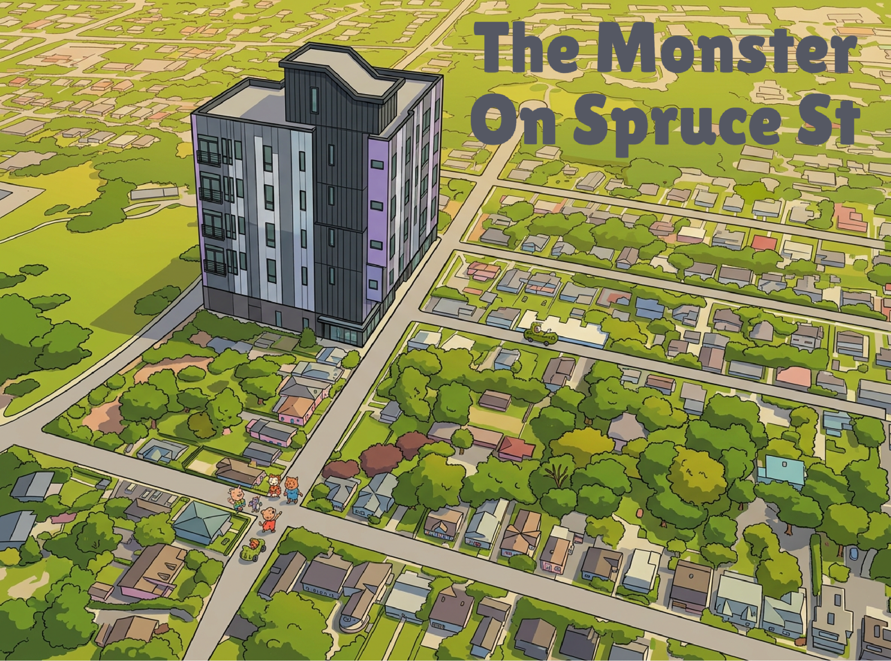
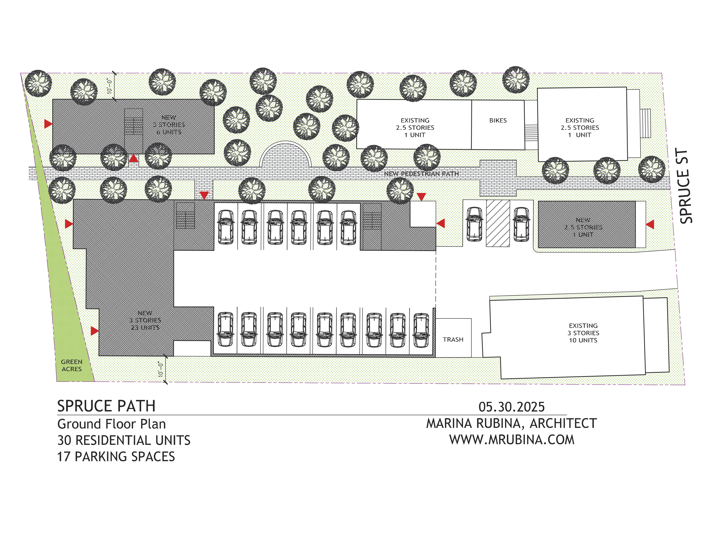
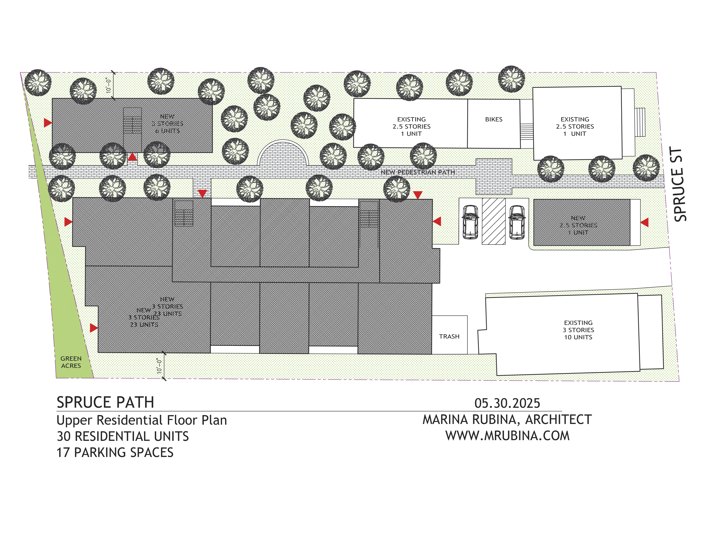

{: .text-center }

# A Note to My Neighbors on Spruce Street and Pine Street
{: .no_toc }

*Regarding the proposed development at 86–88 and 92–94 Spruce Street*
{: .fs-5 .fw-300 }

**April 2026 · Adam Wolf, 82 Spruce Street · [adam.von.wolfhausen@gmail.com](mailto:adam.von.wolfhausen@gmail.com) · 609-480-2491**

---

  
Contents

  {: .text-delta }
1. TOC
{:toc}

---

Dear Neighbor,

I live at 82 Spruce Street, directly next to the lot at 86–88 and 92-94 Spruce Street. I am writing because something significant is being planned for our block, and I don't think any of us were told about it and allowed to weigh in.

I want to be straightforward about who I am and what I am asking, because the politics of housing in Princeton are charged right now and I don't want to be misread.

## What I Believe

I support Princeton's affordable housing obligations. I am glad Princeton is meeting its Mount Laurel requirements. I think the Tree Streets neighborhood — our block, Pine Street, the surrounding streets — is already a model of what good, inclusive, mixed-income housing looks like. We have single-family homes, duplexes, basement apartments, and small apartment buildings of six and ten units. We are genuinely diverse in income, background, and household type. I love this neighborhood and want it to stay that way.

My concern is not whether affordable housing should be built near me. My concern is whether what is actually proposed here — the specific design, density, and process — is appropriate for our specific street, and whether the legal requirements and common courtesy for notifying neighbors were followed.

## What Is Being Proposed

The two parcels at 86–88 Spruce Street (the large apartment building) and 92–94 Spruce Street (the duplex next to it) were [rezoned by the Princeton Council in February 2026](docs/appendix-a-ordinance.pdf) to a new zone called "AH-12," created exclusively for these two lots owned by Barsky Enterprises. Under this new zoning, a developer plans to add 30 new residential units to the site, bringing the total to 42 units on 0.66 acres.

That works out to approximately **64 units per acre**. To put that in perspective:

| Comparison | Density |
|:-----------|--------:|
| Princeton's highest-density mixed-use zone (cap) | 14 units/acre |
| The Alice, N. Harrison St. (near transit hub) | 21 units/acre |
| 2023 Princeton Master Plan designation for our neighborhood | 4–20 units/acre |
| **Proposed AH-12 at 86–96 Spruce St.** | **~64 units/acre** |

The proposed density is **three times** the upper bound of our own neighborhood's Master Plan designation.

The new zoning also permits:
- **75% impervious coverage** — nearly eliminating all lawn and permeable surface on the site
- A **rear yard setback of only 5 feet** from neighboring properties
- A **building separation of only 5 feet** between structures

These standards are more permissive than any other residential zone in the Borough, including the affordable housing overlay zones on Hamilton Avenue directly behind these lots.

The proposed development would provide **17 parking spaces for 42 total units** — fewer than one space for every two households. Current tenants at 86–88 Spruce already have a right to 12 of those spaces, leaving just 5 spaces for 30 new units. This would affect street parking across the entire Tree Street area. The major artery to reach this development is Pine Street, a narrow street that dead-ends at Spruce.

*Figure 1: Proposed site plan for 86–96 Spruce Street.*

*Figure 2: Proposed site plan — additional view.*

### The financial stakes

The rezoning itself is the prize — not the development. A [detailed pro forma analysis](financial-analysis) of this project estimates that the AH-12 ordinance created approximately **$8.5 million in new property value** the moment it was adopted, by granting permission to build at nearly four times the density the Master Plan contemplates for this neighborhood. That value transferred to Barsky Enterprises by municipal vote, not by any investment or improvement on the developer's part.

The developer does not need to build a single unit to realize that value. The rezoned parcels could be sold to a private equity buyer tomorrow, and a corporate owner would carry full legal entitlement to enforce the new zoning — including the right to sue the municipality to compel it. Promises associated with this development, such as the bike path to downtown referenced by Council President Sacks in *Town Topics*, are not conditions written into the ordinance and would not be binding on any future owner.

## What Concerns Me About the Process

Council President Mia Sacks described this site publicly as "a late inclusion to the Fourth Round" — meaning it was added to Princeton's housing plan after the main planning process was complete, without the analysis that other sites went through. In fact the site drawing dates from May 2025 and the draft zoning submitted to the Fourth Round is from June 2025, meaning that the city essentially greenlit a major development at the behest of Barsky Enterprises immediately and without any community engagement. Unlike all the other Affordable Housing districts, this development sits far outside the areas targeted for densification in the master plan (ie Nassau, Witherspoon and North Harrison), and was never contemplated in the Reexamination. 

Specifically:

**No stormwater analysis was performed.** The site sits adjacent to a culverted section of Harry's Brook. [Prior development here in 2019–2020 was conditioned on installing rain gardens](docs/rain-gardens-86-spruce.pdf) to manage runoff. The new plan would eliminate those rain gardens and cover nearly the entire site in pavement, without any engineering study of the downstream impact.

**No traffic study was performed.** Hamilton Avenue — adjacent to the development — is identified in Princeton's own Master Plan as a Vision Zero safety priority corridor requiring improvements. Adding significant new vehicle trips through this intersection was not studied, nor was the impact of adding traffic on Pine Street.

**Key standards were quietly reduced.** Between the [draft ordinance](docs/appendix-e-draft-ordinance.pdf) filed with the Superior Court in June 2025 and the [final version](docs/appendix-a-ordinance.pdf) adopted in February 2026, the minimum building separation was reduced from 15 feet to 5 feet and the parking ratio was reduced from 0.55 to 0.425 spaces per unit. There was no public explanation of why.

**Notice was defective.** The [published notice of the ordinance](docs/appendix-c-notice.pdf) did not identify the property by street address or describe what was changing. And I — a next-door neighbor — never received the certified mail notice that New Jersey law requires be sent to property owners within 200 feet before a zoning change is adopted. The City Clerk confirmed that they have no records of any attempt to contact nearby property owners.

That last point matters. New Jersey's Municipal Land Use Law (N.J.S.A. 40:55D-62.1) requires certified mail to 200-foot neighbors at least 10 days before a rezoning hearing. It is a statutory right, not a formality. Courts have held that failure to provide it can render an ordinance void.

## What Has Happened Since

I [filed a challenge](docs/legal-challenge.pdf) in Mercer County Superior Court on April 9, 2026. The challenge argues that the ordinance should be declared void due to defective notice, and that the rezoning is inconsistent with [Princeton's own 2023 Master Plan](docs/princeton-master-plan-2023.pdf) — a plan that our community spent two years and hundreds of public comments helping to shape.

I want to be clear about what the challenge does and does not seek. It does not challenge Princeton's Fourth Round Housing Plan as a whole, which I support. It does not seek to prevent affordable housing from being built in our neighborhood. It argues that this specific ordinance, applied to this specific site, was adopted without proper notice or adequate analysis — and that the community deserves a proper process.

I also want to be clear that this is expensive and not something I undertook lightly. I did it because I believe every neighbor has a right to proper notice before their block is fundamentally changed — and because the planning questions here (stormwater, traffic, density, fire access) are real and have real answers, if anyone would do the studies.

## What I Am Asking of You

**If you were not notified** by the Municipality of Princeton about a proposed AH-12 zoning change before February 23, 2026 — please let me know. Each neighbor who can confirm this strengthens the record of what happened.

**Sign up for Planning Board notifications** at [princetonnj.gov](https://www.princetonnj.gov) so you are notified when this matter comes before the Planning Board for site plan review, which is the next stage regardless of how the court matter resolves.

**Reach out if you have questions** or want to understand more. I am happy to share what I have learned, and I am not asking you to take any position you are not comfortable with.

You do not need to be opposed to affordable housing — I am not — to think that our neighborhood deserves a proper planning process: a stormwater study, a traffic analysis, a genuine look at whether 64 units per acre is the right fit for Spruce Street.

## The Bigger Picture

I recognize that in Princeton right now, any question about housing density can be read as opposition to affordable housing or to diversity. I want to address that directly.

Our neighborhood — Spruce Street, Pine Street, the Tree Streets — is not an insulated enclave. We are already one of Princeton's most diverse and dense residential blocks. The argument I am making is not "not here." It is "not like this, without proper study, without proper notice, and at a scale the Master Plan does not contemplate for our neighborhood."

Princeton built its affordable housing obligation out of a history of exclusion. That history is real and it matters. So does the obligation to do this right: with honest analysis, lawful process, and respect for the neighbors who will live with the result.

Thank you for reading this. I know it is a lot. I am happy to talk in person or by phone if you have questions.

---

*Adam Wolf · 82 Spruce Street, Princeton, NJ 08540*
*[adam.von.wolfhausen@gmail.com](mailto:adam.von.wolfhausen@gmail.com) · 609-480-2491*
