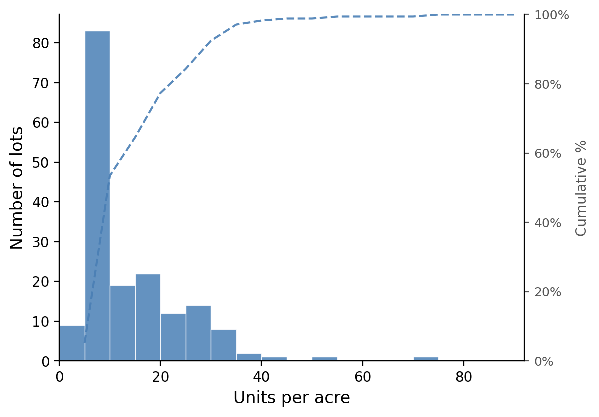
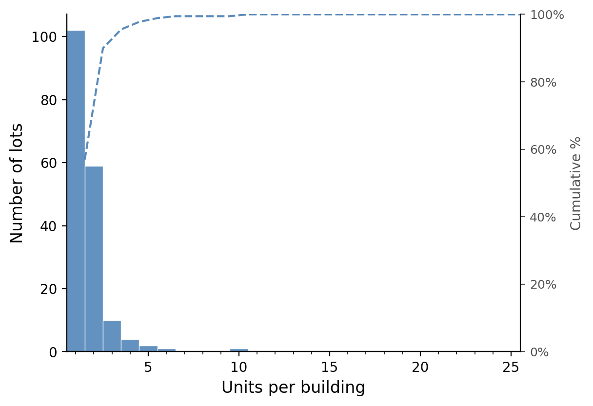
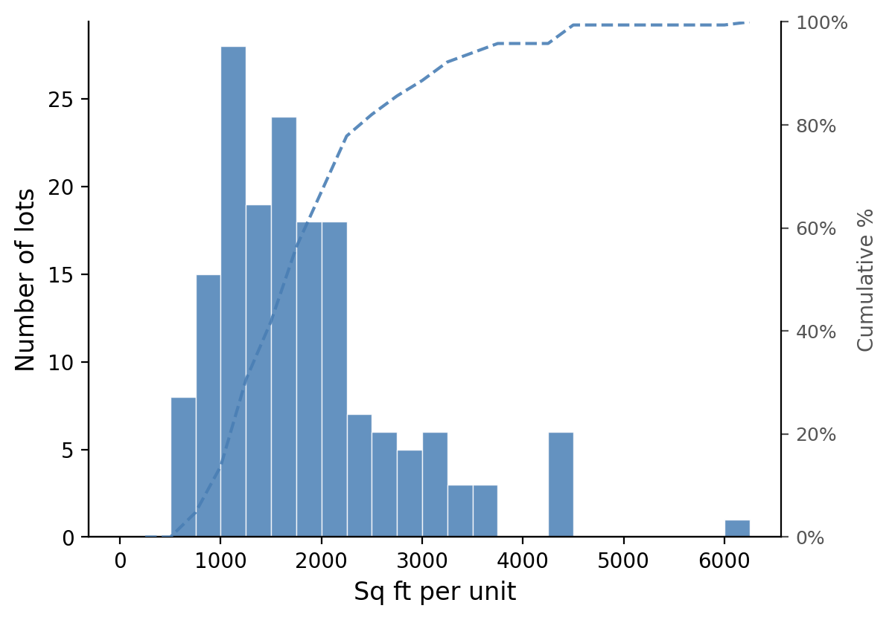
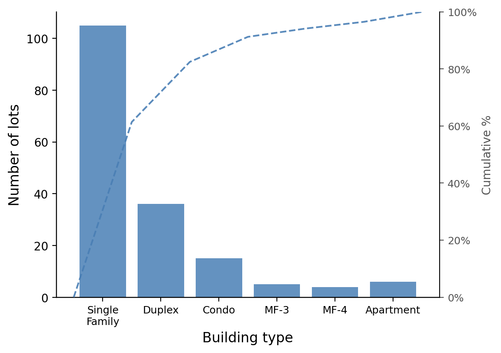
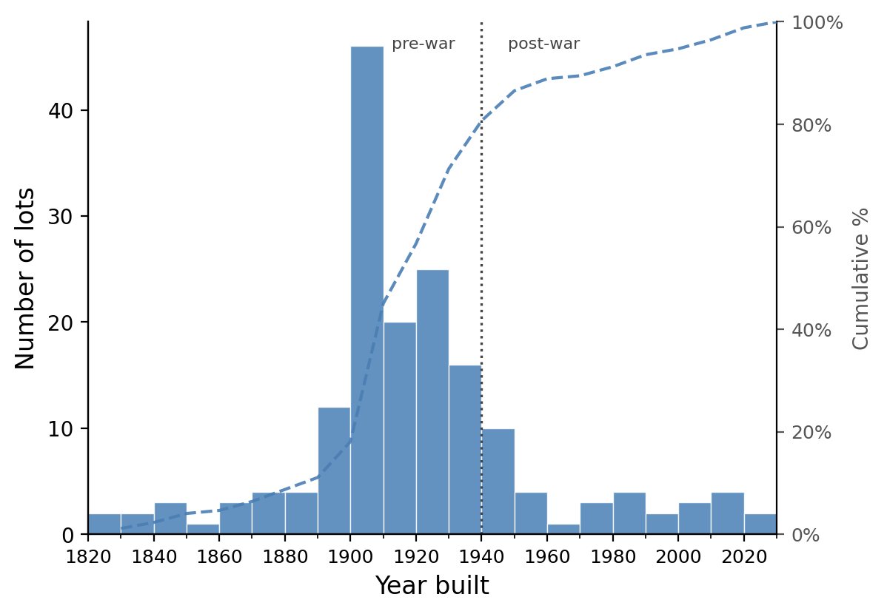
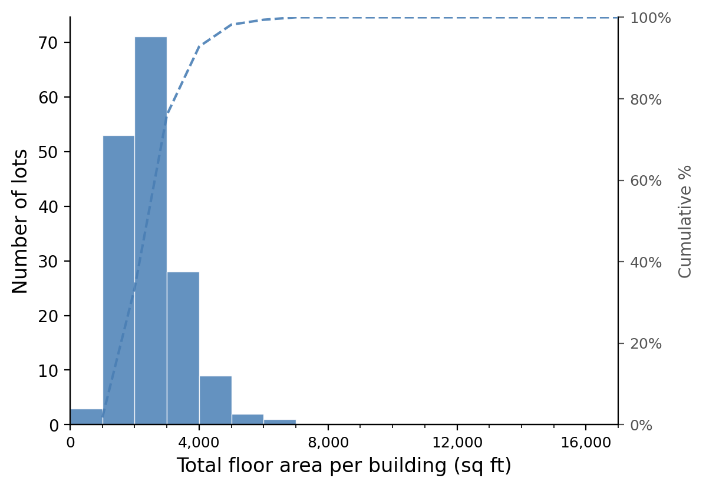
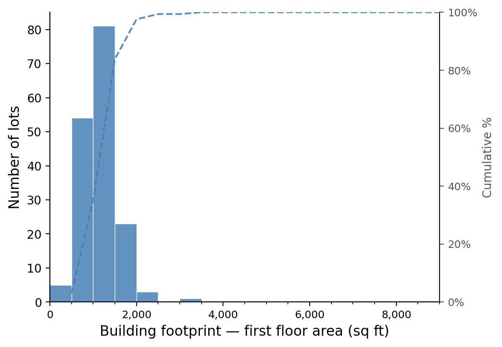
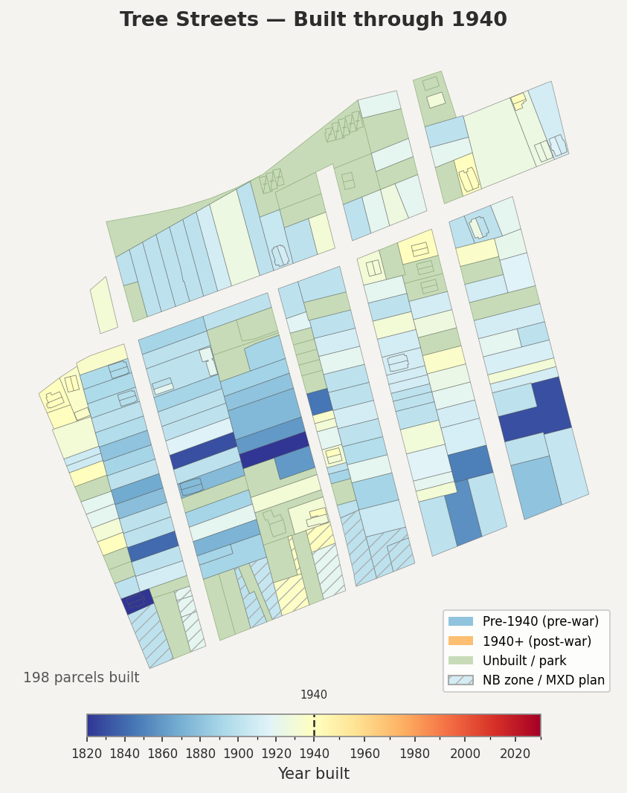

# The Tree Streets Neighborhood
{: .no_toc }

**Princeton, NJ**
*A portrait of who we are*
{: .fs-5 .fw-300 }

---

  
Contents

  {: .text-delta }
1. TOC
{:toc}

---

Much of the argument over 86–96 Spruce Street turns on a question of fit: what kind of neighborhood is this, and what belongs in it? That question is usually answered with adjectives. This page answers it with the public record — tax rolls, parcel maps, and building assessments for every residential lot in the neighborhood core.

Nothing here is an argument about the rezoning. It is a description of the place, offered so that the arguments elsewhere on this site can be checked against it.

---

## Who we are

The Tree Streets neighborhood — Spruce, Linden, Chestnut, Maple, and their cross streets — is one of Princeton's most distinctive and enduring residential communities. You can see the embryonic neighborhood in the [Bevan Survey of 1839](https://townshipandborough.org/spy?v=17.53/-74.65281/40.35268/r1000/btopo_1840/sbevan_1839), the [Otley & Kelly map of 1849](https://townshipandborough.org/spy?v=17.53/-74.65281/40.35268/r1000/btopo_1840/sotley_detail_1849), the [Fulton map of 1875](https://townshipandborough.org/spy?v=17.53/-74.65281/40.35268/r1000/btopo_1840/sfulton_1875), and of course built out on the [Sanborn Atlases](https://townshipandborough.org/spy?v=17.53/-74.65281/40.35268/r1000/btopo_1840/ssanborn_1895).

This portrait draws on public property tax records, GIS parcel data, and building assessments for **172 residential lots** in the neighborhood core. The estimated residential population, counting bedrooms as a proxy for residents, is roughly **665 people**. Two-thirds of those properties are owner-occupied; one-third are rentals. The housing stock is overwhelmingly pre-war — **81% of homes were built before 1940**, and the oldest structure dates to 1820.

---

## The housing stock

The eight figures below summarize the physical character of the neighborhood's buildings, based on municipal property records. Each chart covers R-4 / MDR 1-4 zoned lots only; Nassau Street mixed-use frontage is excluded. Each chart counts the whole neighborhood together, without separating owner-occupied from rental; the dashed line reads against the right-hand axis as a cumulative percentage.

### Density — units per acre

Most lots fall between 5 and 20 units per acre — about 72% of them — a moderate urban density consistent with the neighborhood's mix of detached houses and duplexes on mid-sized lots. The median lot sits at roughly 9 units per acre. The long right tail reflects a small number of very small lots on Pine where a modest house sits on only a fraction of an acre.

---

### Building size — units per building

The overwhelming majority of buildings in the neighborhood contain one or two units — 90% of the 179 buildings counted. Single-family detached homes account for the largest share; duplexes — often a ground-floor and upper-floor apartment in a converted Victorian-era house — make up most of the two-unit category. Buildings with five or more units are rare: four properties on Spruce Street contain between five and ten apartments each, representing a distinct and small part of the neighborhood's fabric.

---

### Unit size — square feet per unit

Unit sizes span a wide range, from compact apartments near 500 square feet to large single-family homes exceeding 6,000. The median unit is about 1,680 square feet. The two humps in that distribution are largely a tenure story: the median owner-occupied unit is roughly 1,880 square feet, the median rental about 1,175 — reflecting the neighborhood's mix of family homes and converted rental housing.

---

### Building height — stories

Two-story construction dominates — 87% of lots. The neighborhood's characteristic profile — gabled two-story frame houses, often with a front porch — accounts for the vast majority of buildings. A small number of 2½- and 3-story structures represent the taller Victorian and Edwardian-era homes. There are only six one-story houses.

---

### Building type

Single-family detached homes are the most common building type — 101 lots — followed by two-family conversions and duplexes at 36 between them. Condominiums, typically small clusters of attached units built in the 1980s and 1990s, account for 15. Row houses, end-row townhouses, and purpose-built apartment buildings each represent a small but distinct part of the mix, adding to the variety that gives the neighborhood much of its character.

---

### Age of housing stock — year built

The neighborhood's housing stock was built primarily between 1890 and 1940, with a pronounced peak in 1900–1910 — 46 lots in that single decade, more than any two other decades combined. This era of construction accounts for the neighborhood's architectural coherence: the two-story frame and clapboard houses with front porches and mature shade trees that define the streetscape.

The dotted line marks 1940. Building drops off sharply after 1940 and never recovers its former pace: a modest postwar cohort in the 1940s, then only a scatter of infill — condos in the 1980s and 1990s, a handful of recent single-family rebuilds — through to the present.

---

### Total floor area per building

Whole-building floor area centers on about 2,250 square feet. The rental stock is not built smaller so much as divided more finely: a two-unit converted house and a single-family home of the same vintage often occupy nearly identical envelopes, which is why rental and owner-occupied buildings span much the same range on this measure, even though they pull apart sharply once measured per unit.

---

### Building footprint — first floor area

Median ground-floor footprint is about 1,120 square feet. Combined with the two-story norm and the typical lot size, this is the number that explains the streetscape: buildings that cover a modest fraction of their lots, leaving the side yards, front setbacks, and rear gardens that the tree canopy grows in.

---

## How the neighborhood filled in

<video src="fig/treestreets/treestreets_construction_slim.mp4" autoplay loop muted playsinline controls style="max-width: 100%; height: auto;"></video>

*Construction decade by decade, from 1820 to the present, with each lot colored by the year its building went up and unbuilt land shown in park green. If the animation does not play, an [animated GIF version](fig/treestreets/treestreets_construction_slim.gif) is also available.*

Watched in order, the sequence shows the neighborhood arriving in essentially one generation. Twelve lots are built by 1860 and 32 by 1890; then the turn-of-the-century wave fills 89 lots by 1900 and 143 by 1920.

By 1940 — the frame above — 198 of the 262 parcels are standing, and the street grid is recognizably the one that exists today. Everything after that is infill.

These maps count parcels, not the 172 residential lots the statistics above are built on. Same ground, different unit: the maps draw every parcel in the neighborhood, including the Nassau Street commercial frontage (hatched) and each condo unit as its own polygon, while the statistics drop the non-residential parcels and fold condo units back into the lot they sit on.

---

## Four kinds of households

Using statistical clustering on seven dimensions of building character — density, unit size, height, age, tenure type, bedrooms, and unit count — the neighborhood's lots group naturally into four household types. Of the 172 lots, 163 have a complete enough record to classify; together the four types account for **95% of estimated residents**.

---

### Type 1 — The Classic Tree Streets Home
*73 properties · ~271 residents · 41% of the neighborhood*

| | |
|---|---|
| Ownership | 95% owner-occupied |
| Density | ~8 units per acre |
| Unit size | ~2,110 sq ft |
| Bedrooms | 3 per unit |
| Stories | 2 |
| Typical vintage | Built ~1900 |

These are the houses most people picture when they think of the Tree Streets. Large, well-maintained two-story frame homes on modest lots, with three or more bedrooms, mature trees in the yard, and a front porch. They were built around the turn of the twentieth century and are almost entirely owner-occupied today. They represent the neighborhood's architectural and demographic anchor — families who have chosen to put down roots here, often for decades.

---

### Type 2 — The Old Rental Stock
*68 properties · ~288 residents · 43% of the neighborhood*

| | |
|---|---|
| Ownership | 62% rental |
| Density | ~18 units per acre |
| Unit size | ~1,110 sq ft |
| Bedrooms | 2 per unit |
| Stories | 2 |
| Typical vintage | Built ~1910 |

Built at the same time as the Type 1 homes and often indistinguishable from the street, these properties have been subdivided into two units — typically a ground-floor and upper-floor apartment. They provide the neighborhood's supply of modestly priced rental housing and have done so for generations. At roughly twice the density of the owner-occupied stock, they are the reason the Tree Streets can accommodate a diverse range of households, including students, young professionals, and longtime renters who have made this neighborhood home for decades.

This is the largest building type by population — it houses more people than the classic single-family stock does.

---

### Type 3 — Modern Infill and Condos
*17 properties · ~62 residents · 9% of the neighborhood*

| | |
|---|---|
| Ownership | 77% owner-occupied |
| Density | ~9 units per acre |
| Unit size | ~2,160 sq ft |
| Bedrooms | 3 per unit |
| Stories | 2 |
| Typical vintage | Built ~2000 |

A younger cohort, built primarily after 1980, including the condominium associations that were developed along the neighborhood's edges in the late twentieth century and the small number of recently constructed single-family homes. Their footprints and heights are similar to the older owner-occupied stock, but their interiors are more contemporary. Largely owner-occupied, they add a layer of architectural variety — and a set of newer neighbors — to the neighborhood's predominantly early-twentieth-century fabric.

---

### Type 4 — Small Mid-Century Homes
*5 properties · ~12 residents · 2% of the neighborhood*

| | |
|---|---|
| Ownership | mixed (2 of 5 owner-occupied) |
| Density | ~7 units per acre |
| Unit size | ~1,330 sq ft |
| Bedrooms | 2 per unit |
| Stories | 1 |
| Typical vintage | Built ~1955 |

A small group of one-story homes built in the postwar decades. More modest in scale than the surrounding Victorian and Edwardian stock, these houses occupy similar-sized lots but with a lower profile and a different architectural vocabulary — ranch-style or bungalow forms that reflect the tastes and construction economics of the mid-twentieth century.

---

## A neighborhood worth knowing

The Tree Streets is not a homogeneous place. It is a neighborhood where a three-bedroom Victorian family home sits beside a century-old duplex converted to student apartments, and both are next door to a 1990s condo. That mix — of ownership and rental, of large and small, of old and newer — is not an accident. It reflects more than a century of organic change within a coherent architectural tradition, and it is what makes the neighborhood feel alive.

What the numbers make clear is that this diversity has deep roots. The rental stock is as old as the owner-occupied stock — 1910 against 1900, the same builders working the same streets in the same decade. The small units and the large ones went up together. The neighborhood has always been for everyone.

---

## Sources and method

**Property and parcel data**
- NJ MOD-IV property tax records, Mercer County (assessment year 2025)
- NJOGIS statewide parcel GIS layer, Mercer County extract
- Princeton municipal zoning and land use plan layers

**Historical maps** (viewable at [townshipandborough.org](https://townshipandborough.org))
- Bevan Survey of Princeton, 1839
- Otley & Kelly map of Mercer County, 1849
- Fulton map of Princeton, 1875
- Sanborn Fire Insurance Atlas of Princeton, 1895

**Scope**
- 172 residential lots in the R-4 / MDR 1-4 district, excluding block 26.01 other than lot 43
- Nassau Street mixed-use frontage is excluded throughout
- The construction maps count **parcels** (262); the charts and household types count **residential lots** (172). Both describe the same ground. Of the 262 parcels, 48 are non-residential (Nassau Street commercial and mixed-use frontage) and 64 are individual condo units that fold back into 23 parent lots
- Units-per-building uses a third count — 179 **buildings** — because one condominium lot is physically eight duplexes

**Method**
- Population estimated using bedrooms per unit as a resident proxy; these are estimates, not Census counts
- Household types derived by k-means clustering (k = 4, seed 0) on seven standardized property characteristics: density, unit size, height, age, tenure type, bedrooms, and unit count
- 163 of the 172 lots have a complete enough assessment record to classify

---

*This portrait was prepared by Adam Wolf, 82 Spruce Street, Princeton NJ, from public records. It is descriptive rather than argumentative, and is provided for informational purposes only. Corrections or additional data are welcome: [adam.von.wolfhausen@gmail.com](mailto:adam.von.wolfhausen@gmail.com)*
